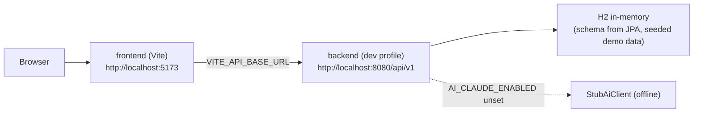

# DigiShield — Local Setup (Full Stack)

A single guide to run the whole DigiShield stack on your machine — from a clean
clone to a working login in the browser. For deeper backend/frontend detail see
the linked docs at the end.

---

## 1. Repository layout

DigiShield is a **monorepo** (one git repo). The three folders you care about:

```
DigiShield_Project/
├─ digishield/     # backend — Spring Boot modular monolith (Gradle, Java 25)
├─ frontend/       # frontend — React 18 + TypeScript + Vite
└─ docs/           # OpenAPI spec (DigiShield_openapi.yaml) + design docs
```

The frontend generates its typed API client from `docs/DigiShield_openapi.yaml`,
so all three folders must be checked out side by side.

---

## 2. Prerequisites

| Tool | Version | Needed for |
|---|---|---|
| **JDK** | **25** (Temurin recommended) | backend build/run (Gradle toolchain may auto-provision it) |
| **Node.js** | **>= 20** | frontend (npm; lockfile is `package-lock.json`) |
| **Docker** | any recent | integration tests (Testcontainers) + the Docker Compose path |
| **git** | any | clone |

> Gradle itself is **not** required — the repo ships the Gradle 9.6.1 wrapper (`./gradlew`).

Quick check:

```bash
java -version    # 25.x
node -v          # v20+
docker --version
```

---

## 3. Pick a run mode

| Mode | Command entry | DB | Docker? | Use when |
|---|---|---|---|---|
| **A. Dev (recommended)** | §4 | H2 in-memory | No | Day-to-day feature work; fastest loop |
| **B. Docker Compose** | §7 | PostgreSQL + Redis + RabbitMQ | Yes | Exercise the full infra locally |
| **C. Prod-like** | `RUN_PRODLIKE.md` | Real PostgreSQL + Flyway | Yes | Verify the actual migration path |

Most work uses **Mode A**. The steps below cover it end to end.



---

## 4. Mode A — Dev (backend + frontend)

### 4.1 Backend (terminal 1)

```bash
cd digishield
./gradlew bootRun --args='--spring.profiles.active=dev'
```

What the `dev` profile gives you (no external infra):

- **API** at `http://localhost:8080/api/v1`
- **H2 in-memory** DB, schema built from JPA entities (Flyway is OFF in dev)
- **Permissive security** (`permitAll`, CSRF off) — no real token needed
- **CORS** open to `http://localhost:5173`
- **Seed data**: one demo user per role under the demo tenant
  `11111111-1111-1111-1111-111111111111`
- Optional H2 console: `http://localhost:8080/h2-console`
  (JDBC `jdbc:h2:mem:digishield`, user `sa`, empty password)

Demo roles seeded: `super_admin`, `org_admin`, `manager`, `content_editor`,
`analyst`, `learner`.

### 4.2 Frontend (terminal 2)

```bash
cd frontend
npm install                 # or: npm ci  (clean, lockfile-exact)
cp .env.example .env        # VITE_API_BASE_URL already points at :8080/api/v1
npm run gen:api             # generate the typed client from ../docs/DigiShield_openapi.yaml
npm run dev                 # http://localhost:5173
```

Open **http://localhost:5173** and log in with a demo user.

---

## 5. Smoke test (verify it works)

With the backend running, dev security is permissive so no token is needed:

```bash
# Login (dev returns static tokens; `role` picks the demo persona)
curl -sX POST http://localhost:8080/api/v1/auth/login \
  -H 'content-type: application/json' \
  -d '{"email":"admin@demo.local","password":"x","role":"org_admin"}'

# Current user — switch persona with the X-Demo-Role header
curl -s http://localhost:8080/api/v1/auth/me -H 'X-Demo-Role: analyst'

# Users list (Users screen data)
curl -s http://localhost:8080/api/v1/users | head
```

Then confirm the frontend at `http://localhost:5173` loads and the login flow works.

---

## 6. Optional — real Claude AI

By default the AI module uses `StubAiClient` (deterministic, offline, no cost).
To exercise the real Anthropic path:

```bash
cd digishield
AI_CLAUDE_ENABLED=true ANTHROPIC_API_KEY=sk-ant-... \
  ./gradlew bootRun --args='--spring.profiles.active=dev'
```

On any Claude error (timeout, rate limit) the call degrades back to the stub, so
endpoints never fail because of the model.

---

## 7. Mode B — Docker Compose (full infra)

Brings up api + worker + scheduler + PostgreSQL + Redis + RabbitMQ:

```bash
cd digishield
docker compose -f deploy/compose/docker-compose.yml up --build
```

- API: `http://localhost:8080` (health: `/actuator/health`)
- PostgreSQL: `localhost:5432` (db/user/pass = `digishield`)
- RabbitMQ UI: `http://localhost:15672`
- Redis: `localhost:6379`

For the real migration path (PostgreSQL + Flyway) see **`digishield/RUN_PRODLIKE.md`**.

---

## 8. Running the tests

| Layer | Where | Command |
|---|---|---|
| Backend unit | `digishield` | `./gradlew test` |
| Backend integration (needs Docker) | `digishield` | `./gradlew integrationTest` |
| Backend all + Checkstyle + JaCoCo | `digishield` | `./gradlew check` |
| Frontend unit (Vitest) | `frontend` | `npm run test` |
| API collection (Newman) | `digishield/postman` | `npm install && npm run test:api` |
| E2E (Selenium; needs BE :8080 + FE :5173 up) | `digishield` | `./gradlew :e2e:test -De2e.enabled=true -Dselenium.headless=true` |

> Newman + E2E live on the `test/e2e-automation` branch.

---

## 9. Troubleshooting

| Symptom | Cause / fix |
|---|---|
| `npm run gen:api` fails: spec not found | `docs/DigiShield_openapi.yaml` missing — check out the `docs/` folder next to `frontend/`. |
| Frontend calls fail with CORS/404 | Backend not on `:8080`, or `VITE_API_BASE_URL` in `frontend/.env` wrong (must be `http://localhost:8080/api/v1`). |
| `integrationTest` hangs/fails | Docker daemon not running (Testcontainers needs it). |
| `bootRun` fails on Java version | Install JDK 25 (Temurin) or enable Gradle toolchain auto-provisioning. |
| Port 8080 / 5173 already in use | Stop the other process, or change the port (`server.port`, Vite `--port`). |
| Login returns 401 in dev | You are not on the `dev` profile — re-run with `--spring.profiles.active=dev`. |
| H2 console empty | Use JDBC URL `jdbc:h2:mem:digishield`, user `sa`, empty password. |

---

## 10. Related docs

- `digishield/README.md` — backend build, dev profile, run modes, Docker Compose, tests.
- `digishield/RUN_PRODLIKE.md` — prod-like PostgreSQL + Flyway.
- `frontend/README.md` — frontend toolchain, scripts, project structure.
- `digishield/STUDENT_TOPICS.md` — capstone topics, contribution workflow, the 5 test layers.
