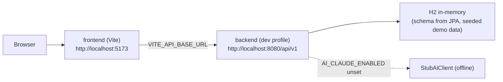

# DigiShield — Local Setup (Full Stack)

A single guide to run the whole DigiShield stack on your machine — from a clean
clone to a working login in the browser. For deeper backend/frontend detail see
the linked docs at the end.

---

## 1. Repository layout

DigiShield is a **monorepo** (one git repo). The three folders you care about:

```
DigiShield_Project/
├─ digishield/     # backend — Spring Boot modular monolith (Gradle, Java 25)
├─ frontend/       # frontend — React 18 + TypeScript + Vite
└─ docs/           # OpenAPI spec (DigiShield_openapi.yaml) + design docs
```

The frontend generates its typed API client from `docs/DigiShield_openapi.yaml`,
so all three folders must be checked out side by side.

---

## 2. Prerequisites

| Tool | Version | Needed for |
|---|---|---|
| **JDK** | **25** (Temurin recommended) | backend build/run (Gradle toolchain may auto-provision it) |
| **Node.js** | **>= 20** | frontend (npm; lockfile is `package-lock.json`) |
| **Docker** | any recent | integration tests (Testcontainers) + the Docker Compose path |
| **git** | any | clone |

> Gradle itself is **not** required — the repo ships the Gradle 9.6.1 wrapper (`./gradlew`).

Quick check:

```bash
java -version    # 25.x
node -v          # v20+
docker --version
```

---

## 3. Pick a run mode

| Mode | Command entry | DB | Docker? | Use when |
|---|---|---|---|---|
| **A. Dev (recommended)** | §4 | H2 in-memory | No | Day-to-day feature work; fastest loop |
| **B. Docker Compose** | §8 | PostgreSQL + Redis | Yes | Exercise the full infra locally |
| **C. Prod-like** | `RUN_PRODLIKE.md` | Real PostgreSQL + Flyway | Yes | Verify the actual migration path |

Most work uses **Mode A**. The steps below cover it end to end.


```mermaid
flowchart LR
  Dev["Browser"] --> FE["frontend (Vite)<br/>http://localhost:5173"]
  FE -->|VITE_API_BASE_URL| BE["backend (dev profile)<br/>http://localhost:8080/api/v1"]
  BE --> H2["H2 in-memory<br/>(schema from JPA, seeded demo data)"]
  BE -.->|AI_CLAUDE_ENABLED unset| STUB["StubAiClient (offline)"]
```

---

## 4. Mode A — Dev (backend + frontend)

### 4.1 Backend (terminal 1)

```bash
cd digishield
./gradlew bootRun --args='--spring.profiles.active=dev'
```

What the `dev` profile gives you (no external infra):

- **API** at `http://localhost:8080/api/v1`
- **H2 in-memory** DB, schema built from JPA entities (Flyway is OFF in dev)
- **Permissive security** (`permitAll`, CSRF off) — no real token needed
- **CORS** open to `http://localhost:5173`
- **Seed data**: one demo user per role under the demo tenant
  `11111111-1111-1111-1111-111111111111`
- Optional H2 console: `http://localhost:8080/h2-console`
  (JDBC `jdbc:h2:mem:digishield`, user `sa`, empty password)

Demo roles seeded: `super_admin`, `org_admin`, `manager`, `content_editor`,
`analyst`, `learner`.

### 4.2 Frontend (terminal 2)

```bash
cd frontend
npm install                 # or: npm ci  (clean, lockfile-exact)
cp .env.example .env        # VITE_API_BASE_URL already points at :8080/api/v1
npm run gen:api             # generate the typed client from ../docs/DigiShield_openapi.yaml
npm run dev                 # http://localhost:5173
```

Open **http://localhost:5173** and log in with a demo user.

---

## 5. Smoke test (verify it works)

With the backend running, dev security is permissive so no token is needed:

```bash
# Login (dev returns static tokens; no credentials are checked)
curl -sX POST http://localhost:8080/api/v1/auth/login \
  -H 'content-type: application/json' \
  -d '{"email":"admin@coquan.gov.vn","password":"x"}'

# Current user
curl -s http://localhost:8080/api/v1/auth/me

# Users list (Users screen data)
curl -s http://localhost:8080/api/v1/users | head
```

Then confirm the frontend at `http://localhost:5173` loads and the login flow works.

**There is no persona switch in `dev`.** The stub tokens carry no identity, so
`/auth/me` always answers with the *first* user of the demo tenant
(`superadmin@digishield.vn`) — see `AuthServiceImpl#currentUser`. The role picked
in the frontend's dev login form is client-side only; the backend never sees it.

To exercise real per-role behaviour, run the **`dev-secure`** profile instead
(`dev` makes every `@PreAuthorize` inert, since method security is
`@Profile("!dev")`):

```bash
cd digishield
./gradlew :boot:app:bootRun --args='--spring.profiles.active=dev-secure'
```

It mints locally signed JWTs (role derived from the email local part) and prints
one Bearer token per role at startup. Note it runs on its own H2 database and has
**no seed data** — every `*DevSeeder` is `@Profile("dev")`.

---

## 6. Local email delivery (fake SES)

By default nothing leaves the machine: no transport is enabled, so
`RoutingNotificationGateway` only logs the would-be delivery
(`No gateway enabled for channel EMAIL — … persisted but not sent`) while the
notification row is still written. To see real emails without an AWS account,
point the SES v2 client at a local server.

```bash
# terminal 3 — fake SES, web mailbox at http://localhost:8005
npx aws-ses-v2-local
```

Restart the backend with SES enabled and the endpoint overridden:

```bash
cd digishield
NOTIFICATIONS_SES_ENABLED=true \
NOTIFICATIONS_EMAIL_FROM=noreply@digishield.local \
AWS_ENDPOINT_URL_SESV2=http://localhost:8005 \
AWS_REGION=ap-southeast-1 \
AWS_ACCESS_KEY_ID=test AWS_SECRET_ACCESS_KEY=test \
PUBLIC_BASE_URL=http://localhost:8080 \
  ./gradlew bootRun --args='--spring.profiles.active=dev'
```

- `AWS_ENDPOINT_URL_SESV2` is honoured by the AWS SDK (2.31.x), so no code change
  is needed to redirect delivery.
- The dummy credentials are still required — the SDK signs every request.
- `PUBLIC_BASE_URL` must be the **backend** origin (`:8080`). Pointing it at Vite
  (`:5173`) still answers `200`, but with the SPA's `index.html`, so the click is
  never tracked.

Trigger a send. Note that `POST /notifications` only *persists* a notification —
the delivery path runs on a campaign launch:

```bash
CID=$(curl -s localhost:8080/api/v1/sim/campaigns \
  | python3 -c "import json,sys;print([c['id'] for c in json.load(sys.stdin) if c['channel']=='email'][0])")

curl -sX POST localhost:8080/api/v1/sim/campaigns/$CID/send \
  -H 'content-type: application/json' \
  -d '{"userIds":["00000000-0000-0000-0000-000000000005"]}'
```

The mail shows up at `http://localhost:8005` (or as JSON at `GET /store`).
Recipients are resolved from `AppUser.email`, so send to a seeded demo user or
change that user's email first. Campaigns on channels without a transport
(`zalo`, `teams`, `slack`, …) are skipped with a warning; `qr` is delivered over
email by design.

For **real** AWS SES, drop `AWS_ENDPOINT_URL_SESV2` and supply credentials with
`ses:SendEmail`. `NOTIFICATIONS_EMAIL_FROM` must be an identity verified in SES
(it has no default — an empty value makes the notification `FAILED`), and while
the account is in the SES sandbox the recipient must be verified too.

---

## 7. Optional — real Claude AI

By default the AI module uses `StubAiClient` (deterministic, offline, no cost).
To exercise the real Anthropic path:

```bash
cd digishield
AI_CLAUDE_ENABLED=true ANTHROPIC_API_KEY=sk-ant-... \
  ./gradlew bootRun --args='--spring.profiles.active=dev'
```

On any Claude error (timeout, rate limit) the call degrades back to the stub, so
endpoints never fail because of the model.

---

## 8. Mode B — Docker Compose (full infra)

Brings up api + worker + scheduler + PostgreSQL + Redis:

```bash
cd digishield
docker compose -f deploy/compose/docker-compose.yml up --build
```

- API: `http://localhost:8080` (health: `/actuator/health`)
- PostgreSQL: `localhost:5432` (db/user/pass = `digishield`)
- Redis: `localhost:6379`

For the real migration path (PostgreSQL + Flyway) see **`digishield/RUN_PRODLIKE.md`**.

---

## 9. Running the tests

| Layer | Where | Command |
|---|---|---|
| Backend unit | `digishield` | `./gradlew test` |
| Backend integration (needs Docker) | `digishield` | `./gradlew integrationTest` |
| Backend all + Checkstyle + JaCoCo | `digishield` | `./gradlew check` |
| Frontend unit (Vitest) | `frontend` | `npm run test` |
| API collection (Newman) | `digishield/postman` | `npm install && npm run test:api` |
| E2E (Selenium; needs BE :8080 + FE :5173 up) | `digishield` | `./gradlew :e2e:test -De2e.enabled=true -Dselenium.headless=true` |

> Newman + E2E live on the `test/e2e-automation` branch.

---

## 10. Troubleshooting

| Symptom | Cause / fix |
|---|---|
| `npm run gen:api` fails: spec not found | `docs/DigiShield_openapi.yaml` missing — check out the `docs/` folder next to `frontend/`. |
| Frontend calls fail with CORS/404 | Backend not on `:8080`, or `VITE_API_BASE_URL` in `frontend/.env` wrong (must be `http://localhost:8080/api/v1`). |
| `integrationTest` hangs/fails | Docker daemon not running (Testcontainers needs it). |
| `bootRun` fails on Java version | Install JDK 25 (Temurin) or enable Gradle toolchain auto-provisioning. |
| Port 8080 / 5173 already in use | Stop the other process, or change the port (`server.port`, Vite `--port`). |
| Login returns 401 in dev | You are not on the `dev` profile — re-run with `--spring.profiles.active=dev`. |
| H2 console empty | Use JDBC URL `jdbc:h2:mem:digishield`, user `sa`, empty password. |
| `/auth/me` always returns `superadmin` | Expected in `dev`: stub tokens carry no identity, so the first tenant user is returned. Use the `dev-secure` profile for per-role behaviour. |
| No mail in the fake SES mailbox | `NOTIFICATIONS_SES_ENABLED` not set, or the notification was created with `POST /notifications` (persist only) instead of a campaign launch. |
| Tracking link in the email opens the SPA | `PUBLIC_BASE_URL` points at Vite (`:5173`); set it to `http://localhost:8080`. |

---

## 11. Related docs

- `digishield/README.md` — backend build, dev profile, run modes, Docker Compose, tests.
- `digishield/RUN_PRODLIKE.md` — prod-like PostgreSQL + Flyway.
- `frontend/README.md` — frontend toolchain, scripts, project structure.
- **STUDENT_TOPICS.html** — the 20 capstone topics, contribution workflow, the 5 test layers. Handed out by the lecturer and kept outside this repository; open it in a browser from wherever you received it.
