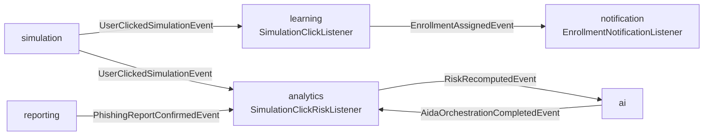
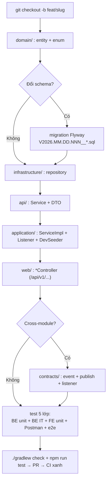
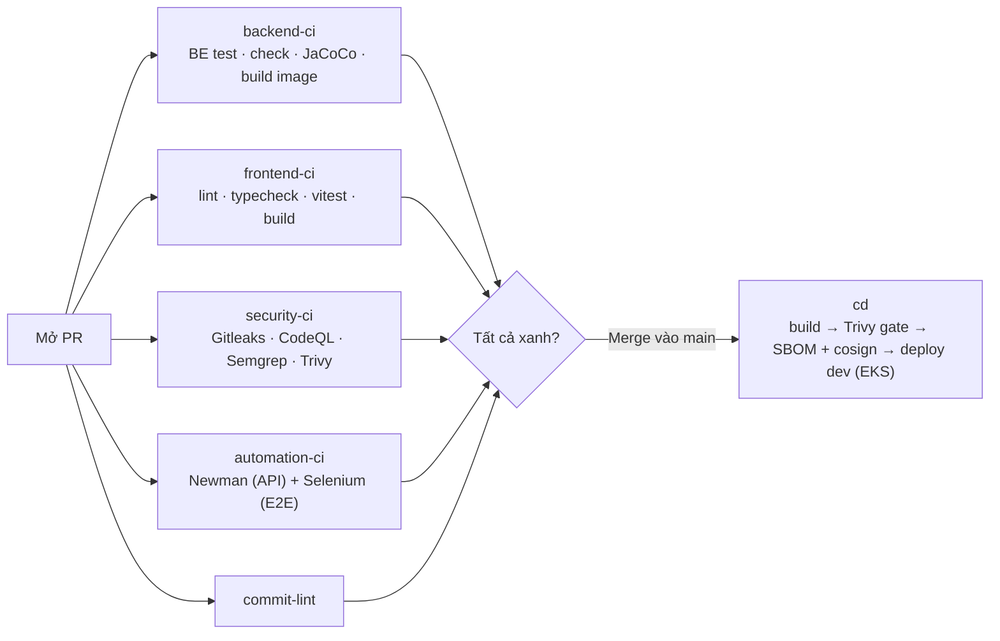
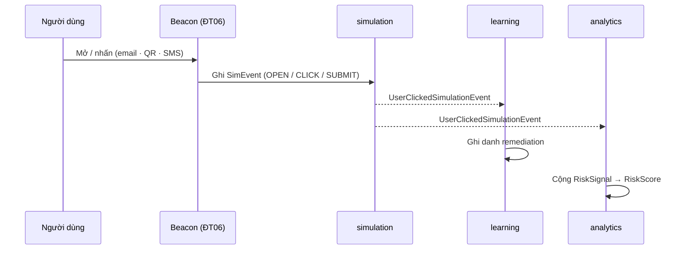
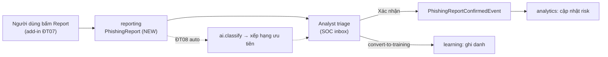
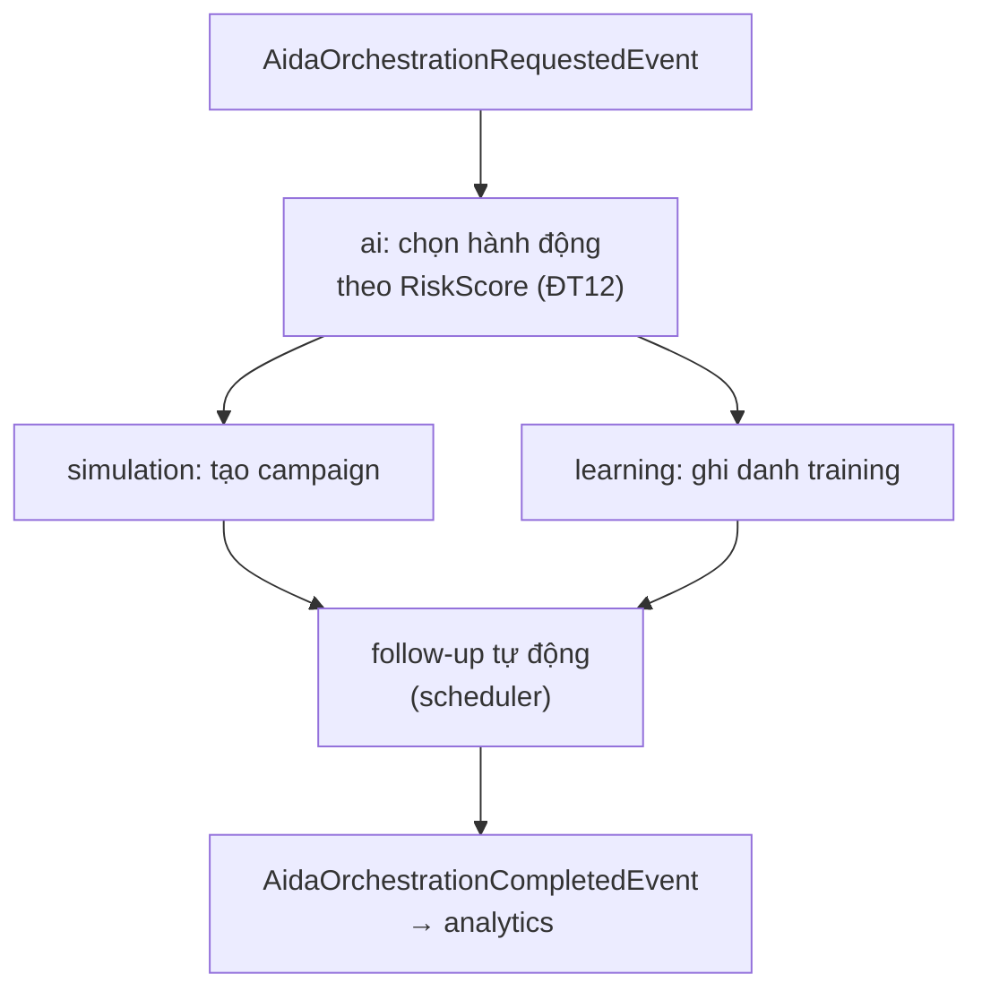

# DigiShield — Hướng dẫn triển khai 15 đề tài sinh viên

Tài liệu này bổ trợ cho danh mục 15 đề tài. Với **mỗi nhóm** nó chỉ rõ: **code ở đâu**,
**làm gì**, và **workflow (luồng xử lý + quy trình đóng góp)**.

> Đọc phần **0. Nền tảng chung** trước — nó mô tả kiến trúc + "công thức đóng góp"
> áp dụng cho *mọi* đề tài, để phần từng nhóm chỉ tập trung vào điểm khác biệt.

---

## 0. Nền tảng chung (đọc trước)

### 0.1 Kiến trúc

- **Modular monolith** trên Spring Boot 4.1 + **Spring Modulith 2.1**, Java 25, Gradle.
- 9 module nghiệp vụ ở `modules/`: `auth, tenancy, simulation, learning, reporting,
  analytics, notification, ai, interception`.
- Mỗi module tuân theo **layer hexagonal** giống nhau:

  | Thư mục | Vai trò |
  |---|---|
  | `domain/` | Entity JPA + enum (nghiệp vụ thuần, không phụ thuộc framework web) |
  | `infrastructure/` | Spring Data repository |
  | `api/` | **API công khai của module**: interface `*Service` + các DTO/View |
  | `application/` | `*ServiceImpl`, các **listener** sự kiện, `*DevSeeder` (seed dữ liệu dev) |
  | `web/` | REST controller (`*Controller`), map `/api/v1/...` |

- **Giao tiếp giữa các module KHÔNG gọi trực tiếp** mà qua **sự kiện** đặt ở
  `contracts/src/main/java/com/digishield/contracts/events/`. Module A publish event,
  module B lắng nghe bằng `@ApplicationModuleListener` trong `application/`.

### 0.2 Bản đồ sự kiện hiện có (rất quan trọng — hầu hết đề tài "cắm" vào đây)

```
simulation  --UserClickedSimulationEvent-->  learning (SimulationClickListener → ghi danh remediation)
                                         └->  analytics (SimulationClickRiskListener → cộng điểm rủi ro)
learning    --RemediationEnrollmentRequestedEvent--> learning
learning    --EnrollmentAssignedEvent-->  notification (EnrollmentNotificationListener)
reporting   --PhishingReportConfirmedEvent--> analytics (PhishingReportConfirmedListener)
ai/*        --AidaOrchestrationRequestedEvent / AidaOrchestrationCompletedEvent--> ai, analytics
analytics   --RiskRecomputedEvent-->  (mở rộng: dùng cho ĐT12/14)
```



File anchor: `contracts/.../events/*.java`, các listener ở `modules/*/application/*Listener.java`.

### 0.3 Dữ liệu (DB)

- **Dev**: H2 in-memory, `ddl-auto=create-drop` → schema tự sinh từ entity JPA, **không cần migration**.
- **Prod/CI**: PostgreSQL + **Flyway**. Mỗi thay đổi schema phải thêm 1 file migration ở
  `boot/app/src/main/resources/db/migration/` theo quy ước
  `V2026.MM.DD.NNN__mo_ta.sql` (xem các file có sẵn để copy format).
- **Dev seeder**: mỗi module có `application/*DevSeeder.java` (`@Profile("dev")`) để seed dữ liệu mẫu cho frontend.

### 0.4 AI — điểm cắm cho đề tài dùng AI (ĐT01, ĐT08, ĐT14)

- Interface `modules/ai/src/main/java/com/digishield/ai/application/AiClient.java`.
- `AiClientConfig.java` chọn implementation theo thứ tự ưu tiên:
  **`MlAiClient`** (self-host, `research/`) → **`ClaudeAiClient`** (Anthropic) → **`StubAiClient`** (offline, deterministic — dùng cho test).
- Endpoint: `web/AiController.java` (`/api/v1/ai/classify|moderate|templates/generate|orchestration/run`).

### 0.5 Frontend

- Nằm ở repo **anh em** `../frontend` (React + Vite + TS). API client sinh tự động (Orval)
  từ `../docs/DigiShield_openapi.yaml`. Thêm endpoint backend → cập nhật OpenAPI → `npm run gen:api`.

### 0.6 Công thức đóng góp chuẩn (áp dụng cho MỌI đề tài)

```
1. git checkout -b feat/<slug>            # nhánh từ main
2. domain/      : thêm entity + enum
3. migration    : thêm V2026.MM.DD.NNN__*.sql (cho prod/CI)   [nếu đổi schema]
4. infrastructure/ : thêm repository
5. api/         : thêm/đổi interface *Service + DTO
6. application/ : cài *ServiceImpl (+ listener nếu cross-module) (+ DevSeeder nếu cần demo)
7. web/         : thêm endpoint ở *Controller
8. contracts/   : thêm event nếu cần module khác phản ứng
9. test         : *Test (unit) + *IT (integration) + e2e ; ./gradlew check ; mở PR → CI xanh
```



### 0.7 Test & CI/CD — chạy ở đâu

> **5 lớp test BẮT BUỘC cho MỌI đề tài** — thiếu bất kỳ lớp nào coi như chưa "Done".
> Dòng "Test & CI" ở từng đề tài phía dưới chỉ là **trọng tâm gợi ý**, KHÔNG thay thế 5 lớp này.

| # | Lớp test (bắt buộc) | Công cụ | Vị trí | Lệnh |
|---|---|---|---|---|
| 1 | **BE Unit** | JUnit 5 + Mockito | `modules/<m>/src/test/...` (`*Test.java`) | `./gradlew test` |
| 2 | **BE Integration** | Testcontainers (Postgres) | `boot/app/src/integrationTest/...` (`*IT.java`) | `./gradlew integrationTest` |
| 3 | **FE Unit** | Vitest + Testing Library | `../frontend/src/**/*.test.ts(x)` | `npm run test` |
| 4 | **API collection** | Postman → Newman | `digishield/postman/` (collection + environment) | `npm run test:api` |
| 5 | **Automation E2E** | Selenium / Playwright | `digishield/e2e/` | `./gradlew :e2e:test -De2e.enabled=true` |

Phụ trợ (chạy trong `check`): **Modulith boundary** (`ModularityTests`), **Checkstyle**, **JaCoCo**
(coverage — không được giảm). Toàn bộ BE: `./gradlew check`.

**Chi tiết mỗi lớp phải làm gì:**

- **FE unit (lớp 3):** endpoint/màn hình mới ở `../frontend` phải có test Vitest cho component +
  hook gọi API (mock qua client sinh bởi Orval). Hiện FE mới có 1 test → đây là phần phải bù.
- **Postman collection (lớp 4):** MỌI endpoint mới phải có request trong
  `digishield/postman/digishield.postman_collection.json` kèm **test script** (`pm.test(...)`:
  status, schema, trường bắt buộc, ca lỗi/negative). Chạy bằng Newman qua `postman/package.json`.
- **Automation e2e (lớp 5):** tối thiểu 1 kịch bản cho luồng người dùng chính (Page Object trong
  `e2e/src/test/.../pages`, scenario trong `.../scenarios`).

**Workflow CI/CD** (ở monorepo root `../.github/workflows/`):

- `backend-ci.yml` — unit → `check` + integration + JaCoCo → build image. **Required check.**
- `frontend-ci.yml` — `npm ci` → `gen:api` → lint → typecheck → **vitest** → build. **Required check.**
- `security-ci.yml` — Gitleaks, CodeQL, Semgrep, Trivy (SCA+IaC), ZAP (DAST theo lịch).
- `automation-ci.yml` — boot backend+frontend → **Newman (API)** + **Selenium (E2E)** (nhánh e2e).
- `cd.yml` — build → Trivy image gate → SBOM + cosign → deploy dev (Helm/EKS).
- `commit-lint.yml` — bắt buộc Conventional Commits.

**Mọi PR phải xanh các check trên trước khi merge.**



---

## Nhóm A — Mô phỏng đa kênh & nội dung (ĐT01–06)

**Code ở đâu (chung cả nhóm):** module `modules/simulation/`.
Anchor: `domain/Channel.java` (đã khai báo `EMAIL, SMS, QR, USB, VOICE, ZALO, TEAMS, SLACK`),
`domain/SimAction.java` (`DELIVERED, OPEN, CLICK, SUBMIT, REPORT`), `domain/SimEvent.java`,
`domain/SimCampaign.java`, `web/SimulationController.java` (`/api/v1/sim`),
`application/SimulationServiceImpl.java`, event `contracts/.../UserClickedSimulationEvent.java`.

**Làm gì (chung):** phần lớn *kênh đã có ở enum nhưng chưa chạy end-to-end*. Việc chính là hiện thực
**gửi → theo dõi (tracking) → funnel** cho từng kênh, và publish `UserClickedSimulationEvent`
để learning/analytics tự phản ứng (đã nối sẵn).



### ĐT01 — QR-code phishing (quishing)
- **Code:** thêm service sinh QR (thư viện ZXing) trong `simulation/application/`; endpoint
  `POST /api/v1/sim/campaigns/{id}/qr` ở `web/SimulationController.java`; landing + tracking đi qua ĐT06.
  Chấm điểm link: gọi `ai/AiClient.classify` (hoặc `research/phase1_url`).
- **Workflow:** tạo campaign kênh `QR` → sinh QR trỏ `/t/click?...` → người quét → beacon ghi
  `SimEvent(CLICK)` → publish `UserClickedSimulationEvent` → learning ghi danh, analytics cộng risk.
- **Test & CI:** UT cho QR generator; IT ingest event kênh QR; e2e "quét QR → click → submit".

### ĐT02 — SMS phishing (smishing)
- **Code:** implement `notification/api/NotificationGateway` cho SMS (provider AWS SNS/Twilio, có
  stub offline); campaign kênh `SMS`; track theo số điện thoại. Model tiếng Việt: `research/phase2` (PhoBERT).
- **Workflow:** campaign `SMS` → gateway gửi → link rút gọn trỏ beacon (ĐT06) → track CLICK/SUBMIT.
- **Test & CI:** UT mock provider; contract test payload; IT funnel SMS.

### ĐT03 — Vishing / callback (email + gọi điện)
- **Code:** entity kịch bản cuộc gọi ở `domain/`; campaign kênh `VOICE`; IVR stub trong `application/`.
- **Workflow:** gửi email mồi + số bẫy → ai gọi lại → ghi `SimEvent` → đo tỉ lệ.
- **Test & CI:** UT state-machine cuộc gọi; IT event callback.

### ĐT04 — Landing page builder + credential-capture
- **Code:** entity `LandingPage` (`domain/`) + repo (`infrastructure/`) + CRUD ở `web/`; trang public
  render HTML; form **chỉ ghi "đã nhập hay chưa"** (KHÔNG lưu mật khẩu).
- **Workflow:** builder tạo page → gắn campaign → người nhập → sinh `SimAction.SUBMIT` → data-entry funnel.
- **Test & CI:** IT submit → `SUBMIT`; **Playwright e2e** điền form → dashboard tăng.

### ĐT05 — Đính kèm độc hại (attachment)
- **Code:** mở rộng template ở `ai/domain/AiTemplate.java` (đã có `AttachmentView`); beacon trong file (doc/pdf) vô hại.
- **Workflow:** gửi template có đính kèm → mở tệp gọi beacon → ghi `OPEN`.
- **Test & CI:** UT sinh beacon; IT track open.

### ĐT06 — Web beacon endpoints (pixel + redirect) — hạ tầng nền
- **Code:** controller mới `web/TrackingController.java` trong `simulation`: `GET /t/open.gif`
  (trả pixel 1×1), `GET /t/click` (redirect + ghi CLICK). Ánh xạ token → `SimEvent` qua
  `SimulationServiceImpl`. Đây là nền cho ĐT01–05 (hiện event chỉ vào qua `POST /api/v1/sim/events`).
- **Workflow:** email/QR/SMS nhúng URL beacon → mở/nhấn → ghi event → publish `UserClickedSimulationEvent`.
- **Test & CI:** IT beacon → event; test chống bot & double-count (idempotent theo token); **k6 load** endpoint nóng.

---

## Nhóm B — Báo cáo phishing & SOC (ĐT07–08)

**Code ở đâu:** module `modules/interception/` (SOC inbox, watchlist) + `modules/reporting/`
(`domain/PhishingReport.java`, `web/ReportingController.java` `/api/v1/reports`).
Anchor: `interception/web/InterceptionController.java`, `interception/domain/AccountWatchEntry.java`,
event `contracts/.../PhishingReportConfirmedEvent.java`.



### ĐT07 — Nút "Report Phishing" (add-in Outlook/Gmail)
- **Code:** phần backend đã có API report + triage (`reporting`/`interception`). Việc mới là
  **extension** (thư mục mới, ví dụ `../report-addin/`) gọi API; và endpoint `POST /reports` nhận payload từ add-in.
- **Workflow:** người dùng bấm nút → add-in POST email → `PhishingReport(status=NEW)` → analyst
  triage → publish `PhishingReportConfirmedEvent` → analytics cập nhật risk; `convert-to-training`.
- **Test & CI:** UT luồng triage; e2e "report → xuất hiện trong SOC inbox".

### ĐT08 — Abuse-mailbox auto-triage (PhishER-like)
- **Code:** trong `reporting/application/ReportingServiceImpl.java` gọi
  `ai/AiClient.classify()` để tự xếp hạng `PhishingReport`; thêm cột priority (migration + entity).
- **Workflow:** nạp email report → AI classify → sắp xếp hàng đợi SOC theo mức độ → gợi ý hành động.
- **Test & CI:** UT ranking; IT với `StubAiClient` (deterministic, offline).

---

## Nhóm C — Đào tạo & LMS (ĐT09–11)

**Code ở đâu:** module `modules/learning/`.
Anchor: `domain/CoachingPage.java`, `domain/Enrollment.java`, `domain/Assessment.java`,
`application/SimulationClickListener.java` (đã tự ghi danh khi click),
`application/RemediationEnrollmentListener.java`, `web/LearningController.java`.

### ĐT09 — Micro-learning "teachable moment" khi click
- **Code:** mở rộng `CoachingPage` + endpoint hiển thị trang học tương tác; nối vào redirect của ĐT06.
- **Workflow:** click phishing → redirect sang coaching page + micro-quiz → `SimulationClickListener`
  đã ghi danh remediation sẵn.
- **Test & CI:** IT click → enroll; e2e trải nghiệm learner.

### ĐT10 — Trình tạo chương trình đào tạo tự động (ASAP)
- **Code:** entity `TrainingProgram` + engine sinh kế hoạch ở `learning/application/`; dùng
  `notification` để nhắc và `scheduler` profile để chạy theo lịch.
- **Workflow:** wizard chọn nội dung → lịch → task calendar → auto-enroll (publish `EnrollmentAssignedEvent`).
- **Test & CI:** UT engine sinh kế hoạch; IT job lịch tự ghi danh.

### ĐT11 — Lộ trình học thích ứng theo năng lực & rủi ro
- **Code:** trong `LearningServiceImpl` dùng `assessments/placement` + risk score (từ `analytics`)
  để chọn khóa/độ khó (`domain/CourseLevel.java`).
- **Workflow:** placement + risk → thuật toán chọn nội dung → lộ trình cá nhân.
- **Test & CI:** UT thuật toán chọn nội dung (bộ dữ liệu cố định, deterministic).

---

## Nhóm D — Phân tích & Rủi ro (ĐT12–13)

**Code ở đâu:** module `modules/analytics/`.
Anchor: `domain/RiskScore.java`, `domain/RiskSignal.java`, `domain/RiskSignalType.java`,
`application/SimulationClickRiskListener.java`, `application/PhishingReportConfirmedListener.java`,
`web/AnalyticsController.java` (`/api/v1/analytics`), event `contracts/.../RiskRecomputedEvent.java`.

### ĐT12 — Human Risk Score engine (SmartRisk-like)
- **Code:** mở rộng `RiskSignalType` + logic tổng hợp trong `AnalyticsServiceImpl`; publish
  `RiskRecomputedEvent` để `ai`/`simulation` chọn campaign theo phân khúc.
- **Workflow:** các event (click, report, hoàn thành học) → cộng `RiskSignal` → tính `RiskScore`
  theo user/phòng ban → phân khúc → feed AIDA (ĐT14).
- **Test & CI:** UT tính điểm deterministic; IT recompute qua event.

### ĐT13 — Báo cáo lãnh đạo + xuất định kỳ & benchmark
- **Code:** service export (PDF: OpenPDF/Flying Saucer; CSV) trong `analytics/application/`;
  endpoint export ở `web/AnalyticsController.java`; digest chạy bằng `scheduler` + `notification`.
- **Workflow:** tổng hợp dashboard/benchmark → xuất PDF/CSV → gửi email digest định kỳ.
- **Test & CI:** snapshot test nội dung report; IT job digest.

---

## Nhóm E — AI & Tự động hóa (ĐT14)

**Code ở đâu:** module `modules/ai/`.
Anchor: `application/AiClient.java`, `application/AiClientConfig.java`,
`application/{ClaudeAiClient,MlAiClient,StubAiClient}.java`, `domain/AidaRun.java`,
`application/AidaOrchestrationCompletedListener.java`, `web/AiController.java`,
events `contracts/.../Aida*Event.java`.



### ĐT14 — AIDA orchestration nâng cao (auto campaign & follow-up)
- **Code:** mở rộng orchestration đã có: rule chọn test/training theo `RiskScore` (từ ĐT12);
  drip/follow-up dùng `scheduler`. Giảm phụ thuộc Claude: bật `MlAiClient` (self-host `research/`).
- **Workflow:** `AidaOrchestrationRequestedEvent` → chọn hành động theo risk → tạo campaign
  (`simulation`) / ghi danh (`learning`) → follow-up tự động → `AidaOrchestrationCompletedEvent`.
- **Test & CI:** UT rule chọn hành động; IT orchestration end-to-end với `StubAiClient`.

---

## Nhóm F — Chất lượng & DevSecOps (ĐT15)

**Code ở đâu:** `digishield/e2e/` + `digishield/postman/` (nhánh `test/e2e-automation`),
`build.gradle.kts` + `buildSrc/` (convention plugins, JaCoCo/Checkstyle),
`../.github/workflows/{automation-ci,security-ci,cd}.yml`.

### ĐT15 — Hoàn thiện tháp test & DevSecOps gate
- **Làm gì:**
  1. **Hardening e2e**: ổn định selector/timing scenario `AnalystBlocksAccountE2E`, thêm scenario mới,
     **bỏ `continue-on-error`** trong `automation-ci.yml` để E2E thành **gate thật** (có thể chuyển Playwright).
  2. **Coverage gate**: nâng ngưỡng JaCoCo trong `build.gradle.kts` từ **0.10 → 0.60+** theo lộ trình;
     thêm **PITest mutation** để đo chất lượng test thật; bật Checkstyle `ignoreFailures = false`.
  3. **Performance**: thêm **k6** cho endpoint nóng (tracking event, dashboard) — stage non-blocking.
  4. **Supply chain**: `security-ci.yml` (Gitleaks/CodeQL/Semgrep/Trivy) + `cd.yml` (Trivy image gate,
     SBOM CycloneDX, cosign) đã dựng sẵn — nhiệm vụ là **giữ pipeline xanh và biến các cảnh báo thành gate**.
- **Workflow (nghiệm thu):** mọi PR chạy `backend-ci` + `security-ci` + `automation-ci`; merge vào main
  kích hoạt `cd` deploy dev. Đề tài đạt khi **pipeline xanh với gate thật** (không còn `continue-on-error`,
  coverage ≥ ngưỡng, image scan pass).

---

## Phụ lục — Lệnh hay dùng

```bash
# Chạy backend dev (H2, security mở) cho frontend
./gradlew bootRun --args='--spring.profiles.active=dev'

# Unit test nhanh (không cần Docker)
./gradlew test

# Integration test (cần Docker cho Testcontainers)
./gradlew integrationTest

# Toàn bộ: test + integration + Checkstyle + JaCoCo
./gradlew check

# FE unit test (Vitest) — trong repo anh em ../frontend
cd ../frontend && npm run test

# API collection (Newman) — cần backend đang chạy
cd digishield/postman && npm install && npm run test:api

# E2E (nhánh test/e2e-automation, cần backend :8080 + frontend :5173 đang chạy)
./gradlew :e2e:test -De2e.enabled=true -Dselenium.headless=true

# Prod-like (Postgres + Flyway thật) để test migration
docker compose -f deploy/compose/docker-compose.prodlike.yml up --build
```

**Định nghĩa "Done" (bắt buộc mỗi đề tài):**

1. **BE unit** (`*Test.java`) + **BE integration** (`*IT.java`) cho code mới.
2. **FE unit** (Vitest) cho component/hook màn hình mới ở `../frontend`.
3. **Postman collection**: request + test script cho MỌI endpoint mới (`digishield/postman/`).
4. **Automation e2e**: tối thiểu 1 kịch bản Selenium/Playwright cho luồng chính (`digishield/e2e/`).
5. Không giảm coverage (JaCoCo); nhánh `feat/<slug>`; commit **Conventional Commits** (tiếng Anh,
   `commit-lint` chặn nếu sai); **mọi PR phải xanh** `backend-ci` + `frontend-ci` + `security-ci` +
   `automation-ci` + `commit-lint`.
